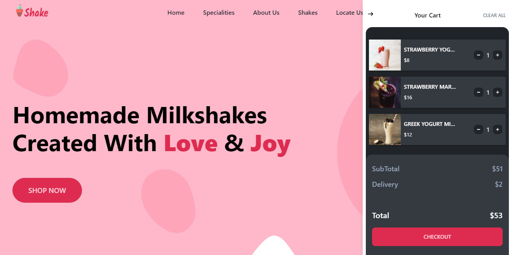
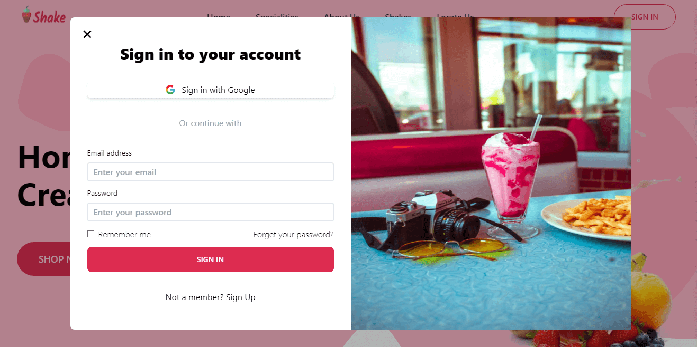
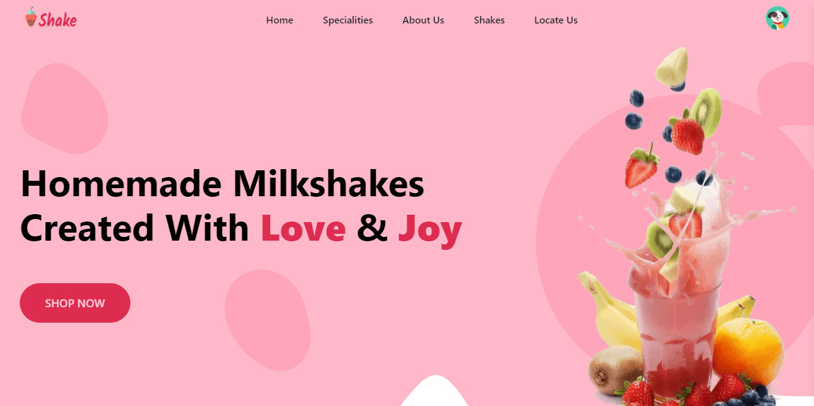
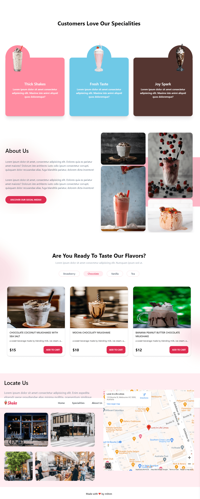

<h1 align="center" style="text-align: center;font-weight: 700; color: #DE3152">Shake</h1>
<p align="center" style="text-align: center">A beverage delivery shop website</p>
<hr></hr>

# Demo
[Click Here](https://shake-roan.vercel.app/#locate-us)

# Features

- Responsive design
- Sign in and sign up
- Forgot password functionality
- User's cart
- ...

# Tech Stack

this project is built with:

- Nextjs and Typescript
- Firebase
- React query with react-query-firebase
- Tailwindcss with daisyUI
- hookstate (for toast notifications state management)

Also:

- react hook form
- react awesome reveal
- react parallax tilt

# Running locally

- Clone this repo
- install dependencies: `npm install` or `yarn add`
- create a `.env.local` file in root directory and fill in firebase config

```env
    NEXT_PUBLIC_FIREBASE_API_KEY=
    NEXT_PUBLIC_FIREBASE_AUTH_DOMAIN=
    NEXT_PUBLIC_FIREBASE_PROJECT_ID=
    NEXT_PUBLIC_FIREBASE_STORAGE_BUCKET=
    NEXT_PUBLIC_FIREBASE_MESSAGING_SENDER_ID=
    NEXT_PUBLIC_FIREBASE_APP_ID=
```

- run `npm run dev`

# Screenshots

- Cart
  

- login form
  

- full page
  
  
